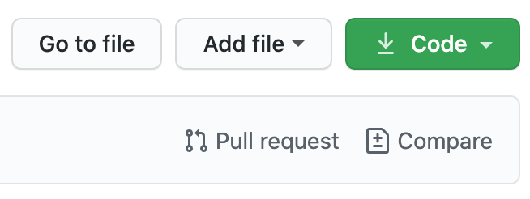

# Everest

[](https://opensource.org/licenses/MIT)

## Table Of Contents

- [License](#license)

- [Description](#description)

- [Deployment](#deployment)

- [Screenshots](#screenshots)

- [Usage](#usage)

- [Contribution](#Contribution)

- [Features](#features)

- [Questions](#questions)

## Description

What can be used but not owned. Can be spent but not kept. Is free but also priceless. And once lost, can never be returned. The answer is “Time”.

Do you ever feel that you never have enough time to get everything done that you want to? Most people can relate to this feeling. Not having enough time to accomplish your goals can negatively impact relationships, schooling, work life balance, and even your confidence. If any of this rings true for you, then our app can help.

We’ve created “Everest”. A mobile time tracking app that will help you focus on achieving desired goals through customizable projects and tasks that you can track with ease. Everest is an amazingly simple and convenient tool to stay on task, get more done, enjoy the personal rewards of accomplishment, and have more time at the end of the day.

So, say goodbye to not having enough time, take control of your life, be the efficient self starter you’ve always wanted to be, and know that getting everything done that you want to will never again feel like climbing Mount Everest.

## Deployment

https://everest-time-manager.herokuapp.com/

## Screenshots


## Usage

1. Go to Home page.
2. Open the Pull Up icon on the bottom of the page.
3. Create a Project you want to work on.
4. Press on Project Name or on the List icon on the right.
5. Create multiple tasks that are part of that project.
6. Begin tracking the time you work on that tasks by pushing start and stop icon from the task.
7. On the Home Page will be displayed the History of your actions.
8. On the Chart Page you will visualize the amount of time you spent on different tasks.
9. If you have other questions, contact any of the Developers listed in the Question Section and we will come friendly with a solution for you.

## Contribution

To contribute on our project follow next steps:

1. Fork the repository.
   In the right corner of the page you should see a fork button. Press on it to fork the repository.

   

2. Copy the SSH link from the forked version of this app.

   

3. Clone the app locally. Insert in your CLI the command similar with the one bellow.

```bash
    git clone git@github.com:<your-git-hub-username>/goals-productivity-tracker.git
```

4. Install all libraries. Insert next command in your CLI:

```bash
npm install
```

5. To start the whole app insert in your CLI:

```bash
npm start
```

6. If you made some improvements in the app, you might want to upload your code, so one way to do this is to follow next steps:

```bash
git add -A
git commit -m "your commit text"
git push
```

7. Make a pull request. Go on your forked version of the app on GitHub, and look for pull request link; then, press on it and follow the steps:

/

8. Congratulation, you completed all steps to become part of the project.

Note:
-- To start just the back end side of your app insert in your CLI:

```bash
node server.js
```

-- To start just the front end part of the app, in your CLI enter in client folder; then insert:

```bash
npm start
```

-- Sometimes you might want to synchronize your local repository with the main branch. To do that follow next steps:

```bash
git remote -v
git remote add upstream <insert-here-ssh-link-from-the-main-branch>
git fetch upstream
git merge upstream/main main
git add .
git commit -m "<inset-here-the-comment-regarding-to-merging"
```

Following the steps above you will be able pull code and synchronize it locally.

## Features

- Material-UI
- Axios
- Bcryptjs
- Bootstrap
- Express
- If-env
- Jsonwebtoken
- Moment
- Mongoose
- Passport
- React
- React-chartsjs-2
- React-social-icons
- Reactstrap

## Questions

Please reach out to any of the developers with questions


Pavel Darii | <paveldarii@yahoo.com>

Eric Ober | <ericscottober@gmail.com>

Adam Lane | <adamlane8719@gmail.com>

Matt Trader | <matthewtrader@sbcglobal.net>

## License

[The MIT License](https://opensource.org/licenses/MIT/)
